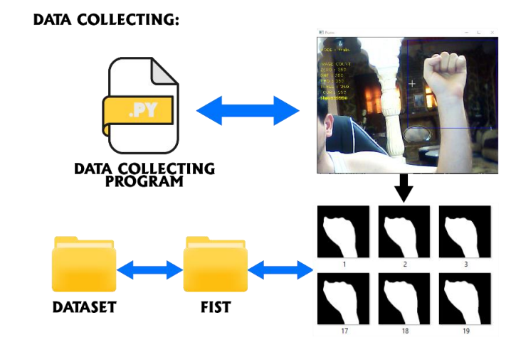

<!-- Create a readme for home automation using hand gesture recognation -->
# Home automation using Hand Gesture Recognition 
## Introduction

This project is about controlling home appliances using hand gestures. The project is based on the concept of hand gesture recognition. The project uses a camera to capture the hand gestures and then the gestures are recognized using a python script. The python script is then connected to the home appliances using a relay module. The relay module is connected to the home appliances and the appliances are controlled using the python script. The project is based on the concept of hand gesture recognition. The project uses a camera to capture the hand gestures and then the gestures are recognized using a python script. The python script is then connected to the home appliances using a relay module. The relay module is connected to the home appliances and the appliances are controlled using the python script.

## Hardware Requirements
1. Raspberry Pi 3
2. Camera Module
3. Relay Module
4. Jumper Wires
5. Breadboard
6. led
7. servo motor

## Software Requirements
2. Windows
3. Raspbian OS

## requirements 
```bash 
pip install -r requirements.txt
```


## Classes
```bash
CLASS_MAP = {0:'fist',
   1:'five',
   2:'none',
   3:'okay',
   4:'L',
   5:'rad',
   6:'three',
 7:'thumbs'}
 ```

<!-- Add an image to readme with specific size-->
## Image


